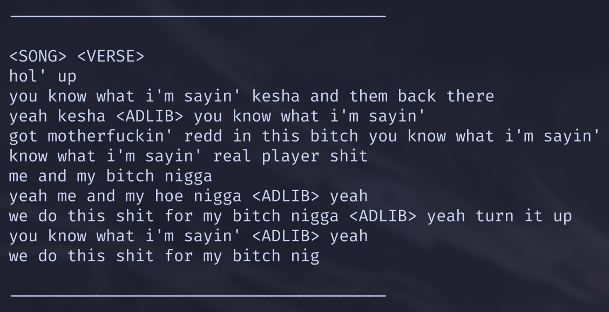

# Playboi Carti Lyrics Generator

Generates lyrics using a GPT-2–style Transformer, trained on a compilation of Playboi Carti’s songs. The dataset is cleaned and annotated with special tokens like `<CHORUS>` and `<ADLIB>`.

## Model Information

- **~28,972,117 parameters**
- **4** Transformer blocks
- **Embedding dim:** 256
- **Block size (context length):** 128
- **Attention heads:** 4
- **Head dim:** 64
- **Vocab size:** 50,261 tokens (including special tokens)

## Training

- Trains from a single text file (can be any artist).
- **macOS (Apple Silicon):** uses MPS by default.
- **Windows/NVIDIA:** change the device to CUDA (and update the device selection logic).

> Example training time: MacBook M4 (16GB) ~15 minutes (varies with dataset size and settings).
